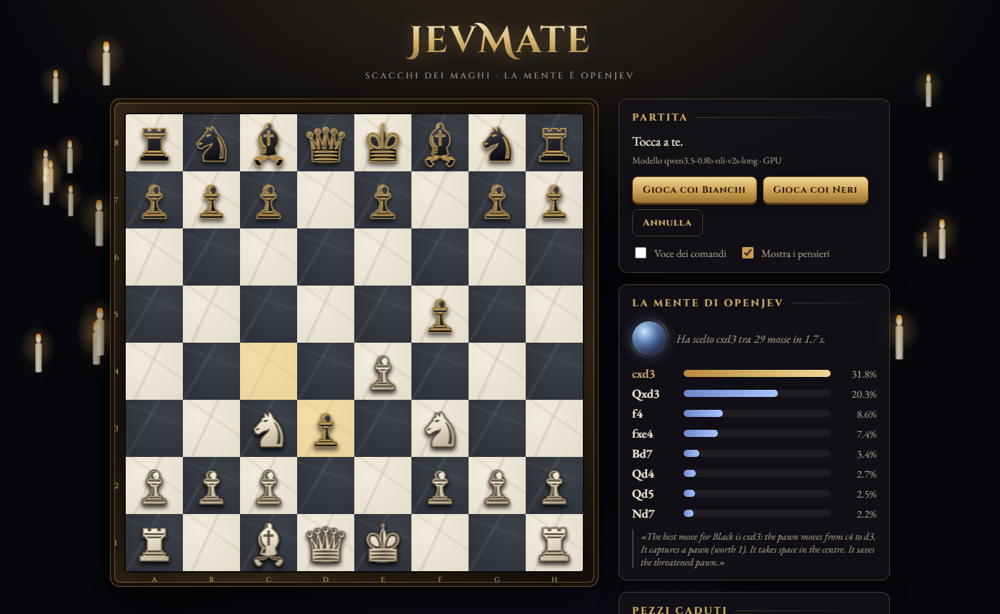

# JevMate — Scacchi dei Maghi

**[English](#english)** · **[Italiano](#italiano)**



---

## English

Human vs computer chess where the computer picks its move with
[OpenJev](https://huggingface.co/AlexWortega/openjev), an NLI cross-encoder built on Qwen3.5. There is no chess
engine behind it.

### How it picks a move

- **Premise:** the position (FEN, material, last move, check, threatened pieces) plus a rubric:
  *"a good move wins material, avoids losing pieces, keeps the king safe and improves the position"*.
- **Hypotheses:** one per legal move, e.g. *"The best move for Black is fxg5: …"*, enriched with facts computed by
  python-chess (capture, check, piece left en prise, pieces left undefended, development in the opening).
- **Choice:** OpenJev gives each hypothesis an entailment probability and the highest one wins. The
  "La mente di OpenJev" panel shows the top 8 moves.

It plays weakly: the facts keep it away from blunders, but it does not look further than one move ahead.

📖 **[How it works](docs/how-it-works.md)**: why OpenJev does not know chess but can still pick a move, a real
example with scores, and the **[next steps](docs/how-it-works.md#6-next-steps-improving-openjevs-mind)** to
make it stronger.

### Install (Windows)

```bat
py -m venv .venv
rem torch: pick the right build (https://pytorch.org/get-started/locally/)
rem   NVIDIA GPU, recent driver:  --index-url https://download.pytorch.org/whl/cu128
rem   old driver (CUDA 11.x):     torch==2.7.1 --index-url https://download.pytorch.org/whl/cu118
rem   CPU only:                   --index-url https://download.pytorch.org/whl/cpu
.venv\Scripts\python -m pip install torch --index-url https://download.pytorch.org/whl/cu128
.venv\Scripts\python -m pip install -r requirements.txt
.venv\Scripts\python scarica_modelli.py
```

### Run

```bat
avvia.cmd
```

Opens http://127.0.0.1:7373. Loading the model takes a few seconds the first time.

**Model:** the 2B checkpoint if the GPU has more than 6.5 GB free, otherwise the 0.8B (also runs on CPU, slower).
To force one: `set OPENJEV_MODEL=qwen3.5-0.8b-nli-v2s-long`. `scarica_modelli.py --anche-2b` also downloads the 2B.

### How to play

Click a piece, then click the target square. Gold dot = empty square, orange ring = capture.
Castling: king → g1/c1. Options: play as Black, undo, spoken commands (Italian voice), show the computer's thoughts.
The interface is in Italian.

### Files

| File | Role |
|---|---|
| `engine.py` | describes the position and the moves, picks the move with OpenJev |
| `server.py` | Flask server: rules (python-chess) and API |
| `static/index.html` | user interface |
| `scarica_modelli.py` | downloads the checkpoints from Hugging Face |

---

## Italiano

Scacchi umano contro computer, dove il computer sceglie la mossa con
[OpenJev](https://huggingface.co/AlexWortega/openjev), un cross-encoder NLI basato su Qwen3.5. Non c'è un motore
scacchistico.

### Come sceglie la mossa

- **Premessa:** la posizione (FEN, materiale, ultima mossa, scacco, pezzi minacciati) più un criterio:
  *"una buona mossa vince materiale, evita di perdere pezzi, tiene il re al sicuro e migliora la posizione"*.
- **Ipotesi:** una per ogni mossa legale, del tipo *"The best move for Black is fxg5: …"*, con i fatti calcolati da
  python-chess (cattura, scacco, pezzo che resta in presa, pezzi lasciati scoperti, sviluppo in apertura).
- **Scelta:** OpenJev dà a ogni ipotesi una probabilità di entailment e vince la più alta. Il pannello
  "La mente di OpenJev" mostra le 8 mosse migliori.

Gioca debole: i fatti gli evitano gli errori grossolani, ma non vede più avanti di una mossa.

📖 **[Come funziona](docs/come-funziona.md)**: perché OpenJev non sa giocare a scacchi ma riesce comunque a
scegliere una mossa, un esempio reale con i punteggi e i
**[prossimi passi](docs/come-funziona.md#6-prossimi-passi-come-migliorare-la-mente-di-openjev)** per renderlo più
forte.

### Installazione (Windows)

```bat
py -m venv .venv
rem torch: scegli la build adatta (https://pytorch.org/get-started/locally/)
rem   GPU NVIDIA con driver recente:  --index-url https://download.pytorch.org/whl/cu128
rem   driver vecchio (CUDA 11.x):     torch==2.7.1 --index-url https://download.pytorch.org/whl/cu118
rem   solo CPU:                       --index-url https://download.pytorch.org/whl/cpu
.venv\Scripts\python -m pip install torch --index-url https://download.pytorch.org/whl/cu128
.venv\Scripts\python -m pip install -r requirements.txt
.venv\Scripts\python scarica_modelli.py
```

### Avvio

```bat
avvia.cmd
```

Apre http://127.0.0.1:7373. Il primo caricamento del modello richiede qualche secondo.

**Modello usato:** il 2B se la GPU ha più di 6,5 GB liberi, altrimenti lo 0.8B (anche su CPU, più lento). Per
forzarne uno: `set OPENJEV_MODEL=qwen3.5-0.8b-nli-v2s-long`. `scarica_modelli.py --anche-2b` scarica anche il 2B.

### Come si gioca

Clic sul pezzo, poi clic sulla casella di arrivo. Punto dorato = casella libera, cerchio arancione = cattura.
Per arroccare: re → g1/c1. Opzioni: gioca coi neri, annulla, voce dei comandi (it-IT), mostra i pensieri.

### Struttura

| File | Ruolo |
|---|---|
| `engine.py` | descrizione della posizione e delle mosse, scelta con OpenJev |
| `server.py` | server Flask: regole (python-chess) e API |
| `static/index.html` | interfaccia |
| `scarica_modelli.py` | download dei checkpoint da Hugging Face |

---

## License / Licenza

Project code: license to be defined · Codice del progetto: licenza da definire.
OpenJev and `modeling_openjev.py` (downloaded into `models/`): MIT, © AlexWortega. Base model: Qwen3.5 (Alibaba).
