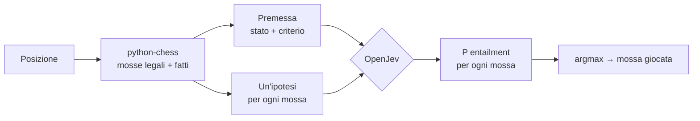

# Come JevMate usa OpenJev per giocare a scacchi

🇬🇧 [English version](how-it-works.md) · [← README](../README.md)

> **In breve:** OpenJev non sa giocare a scacchi. Non conosce le regole, non vede la scacchiera e non calcola
> varianti. A ogni turno legge una descrizione della posizione e una frase per ogni mossa possibile, e dice
> quale frase è più coerente con un criterio di "buona mossa". JevMate gioca quella.

## 1. Che cos'è OpenJev

[OpenJev](https://huggingface.co/AlexWortega/openjev) è un **cross-encoder NLI** (*Natural Language
Inference*) costruito su Qwen3.5. Riceve due testi:

- una **premessa**, che descrive come stanno le cose;
- un'**ipotesi**, un'affermazione da verificare;

e restituisce tre probabilità: **contraddizione**, **implicazione** (*entailment*), **neutro**.

Non genera testo e non ha mai visto una partita a scacchi durante l'addestramento. È un giudice di coerenza
tra frasi: la stessa capacità che usa per verificare risposte, filtrare contenuti o, nel README del modello,
giocare a Doom e Minecraft.

## 2. Il ciclo di decisione

1. **python-chess** genera tutte le mosse legali e, per ognuna, calcola dei fatti oggettivi.
2. JevMate scrive **una premessa** (lo stato della partita più il criterio) e **un'ipotesi per mossa**.
3. **OpenJev** valuta ogni coppia premessa–ipotesi in una sola passata, senza generare nulla.
4. Vince la mossa con la **probabilità di entailment più alta**. Il pannello "La mente di OpenJev" mostra le
   prime 8, normalizzate sul totale.

## 3. Un esempio reale

Partita `1.e4 d5 2.Nf3 f6 3.Bc4 dxc4 4.Nc3 f5 5.d3`, tocca al Nero (immagine nel README).

**Premessa** (una sola per turno):

> Chess position (FEN …). Black is to move. Material: Black 39, White 36. White just played d3. Black pieces
> under threat: pawn on c4. *A good move wins material, avoids losing pieces, keeps the king safe and improves
> the position.*

**Ipotesi** (29, una per mossa legale) e punteggi del modello 0.8B:

| Mossa | Ipotesi (abbreviata) | Entailment | Quota |
|---|---|---|---|
| **cxd3** ✅ | captures a pawn (worth 1) · takes space in the centre · **saves the threatened pawn** | 0,49 | 31,8% |
| Qxd3 | captures a pawn · brings the queen out early · **the queen can be captured (it would lose 9)** | 0,32 | 20,3% |
| f4 | the pawn can be captured · leaves undefended: pawn on c4 | 0,13 | 8,6% |
| fxe4 | captures a pawn · can be captured · leaves c4 undefended · attacks the knight | 0,12 | 7,4% |
| Bd7 | develops the bishop · leaves c4 undefended | 0,05 | 3,4% |
| Qd4 | queen out early · the queen can be captured (it would lose 9) | 0,04 | 2,7% |

Tempo: **1,7 s** per valutare tutte le 29 mosse su una GPU da portatile.

La scelta (cxd3) è giusta, e si vede perché: è l'unica ipotesi che soddisfa **tutte** le parti del criterio
(vince materiale, salva un pezzo, non perde niente). Si vede però anche il limite: **Qxd3 prende il 20%** pur
dicendo esplicitamente che perde la regina. Il modello ha pesato più "cattura un pedone" che "perde 9".

## 4. Chi sa cosa

| Componente | Che cosa porta | Esempio |
|---|---|---|
| **python-chess** | le **regole** e i **fatti**: mosse legali, catture, scacchi, pezzi in presa | "after it the queen on d3 can be captured" |
| **JevMate** (testo) | il **criterio** di buona mossa e la scelta di quali fatti raccontare | "a good move wins material, avoids losing pieces…" |
| **OpenJev** | il **giudizio**: quanto ogni descrizione è coerente con il criterio | 0,49 contro 0,32 |

La conoscenza scacchistica sta quasi tutta nei primi due. OpenJev fa da **arbitro semantico**: legge fatti
eterogenei ("salva un pedone", "porta fuori la regina presto", "lascia c4 scoperto") e li pesa rispetto a un
obiettivo scritto in linguaggio naturale, senza che nessuno abbia scritto una funzione di valutazione con dei
pesi numerici.

## 5. "La mossa più promettente": che cosa significa davvero

OpenJev **non massimizza il risultato della partita**. Massimizza la coerenza della descrizione di una mossa con
il criterio. Le differenze con un motore scacchistico:

| | Motore (es. Stockfish) | JevMate + OpenJev |
|---|---|---|
| Profondità | decine di semimosse, con le risposte dell'avversario | **1 mossa**, nessuna risposta simulata |
| Valutazione | funzione numerica (o rete) addestrata sugli scacchi | coerenza tra frasi, modello mai addestrato sugli scacchi |
| Obiettivo | vincere la partita | soddisfare il criterio scritto nella premessa |
| Spiegabilità | un numero (+1,3) | la frase che ha convinto il modello |

Conseguenze pratiche:

- ✅ **evita gli errori grossolani** quando i fatti li rendono espliciti ("perde 9");
- ✅ **trova le mosse ovvie**: matto in 1, regina lasciata libera;
- ✅ **è deterministico e spiegabile**: stessa posizione, stessa mossa, con il motivo leggibile;
- ❌ **non vede le minacce a due mosse**, le forchette in arrivo o gli scambi a catena: nessun fatto li descrive;
- ❌ **distingue male tra mosse "tranquille"**: quando nessuna cattura o minaccia è in gioco, i punteggi
  diventano piatti (10–12%) e la scelta è poco più che casuale.

## 6. Prossimi passi: come migliorare la mente di OpenJev

Siccome OpenJev giudica solo quello che gli viene raccontato, quasi tutti i miglioramenti consistono nel
**raccontargli meglio la posizione**. La regola resta la stessa: la mossa la sceglie sempre OpenJev, si arricchiscono
le prove e non si decide al posto suo.

| # | Intervento | Cosa cambia | Effetto atteso | Costo |
|---|---|---|---|---|
| 0 | **Misurare prima di migliorare** | partite automatiche contro un avversario casuale e contro Stockfish a livello minimo; percentuale di mosse uguali a quelle di Stockfish su posizioni di test | un numero per capire se ogni modifica aiuta davvero | basso |
| 1 | **Bilancio degli scambi** | per ogni cattura, il saldo dell'intera sequenza sulla casella ("lo scambio ti fa vincere 2" / "perdi 3") al posto del semplice "può essere catturato" | smette di regalare pezzi negli scambi; corregge casi come Qxd3 al 20% | basso |
| 2 | **Una mossa di profondità come fatto** | per ogni mossa, la migliore risposta immediata dell'avversario scritta nell'ipotesi ("dopo la mossa il Bianco può catturare la regina", "dopo la mossa il Bianco ha scacco matto") | vede le trappole a una mossa: forchette, inchiodature, matti in 1 subiti | medio (circa 2–3 s a mossa) |
| 3 | **Criterio scomposto** | invece di una sola ipotesi "è la mossa migliore", più domande per mossa (vince materiale? è sicura? migliora il re?) combinate con dei pesi, come le *typed decisions* di OpenJev | punteggi meno piatti tra le mosse tranquille, scelta più stabile | medio |
| 4 | **Criteri per fase di gioco** | premessa diversa in apertura (sviluppo, arrocco, centro), mediogioco (attività, attacco al re) e finale (re attivo, pedoni passati) | piani più sensati, soprattutto nei finali dove oggi vaga | basso |
| 5 | **Formulazione del criterio** | provare varianti della frase-criterio e dei fatti misurandole col punto 0 | guadagni gratuiti: il modello è sensibile a come si scrive | basso |
| 6 | **Checkpoint più grande** | 4B v5, consigliato dall'autore per le decisioni; serve più memoria video (≈8 GB in bf16) o la quantizzazione | giudizio più fine sugli stessi fatti | alto |
| 7 | **Testa addestrata sugli scacchi** | OpenJev fornisce `LatentMLPHead`: una piccola rete sopra il suo stato interno, addestrabile su posizioni valutate da Stockfish | il salto più grande, ma OpenJev non è più "zero-shot": impara gli scacchi | alto |

**Ordine consigliato:** 0 → 1 → 2 → 4. Sono economici, restano fedeli all'idea (il modello sceglie, il codice
racconta) e coprono i difetti visti finora. Il 7 cambia la natura dell'esperimento: da valutare a parte.

### Risultati misurati (ottobre 2026)

I passi **0, 1, 4 e 5 sono fatti**. Misura con `bench.py`: 100 posizioni fisse (33 di apertura, 45 di mediogioco,
22 di finale), Stockfish 19 a profondità 12 come arbitro, modello 0.8B.

| Versione | ACPL tutte | Apertura | Mediogioco | Finale | Errori gravi (≥ 200 cp) | vs Stockfish livello 0 |
|---|---|---|---|---|---|---|
| v1: prima versione | 180 | 138 | 219 | 162 | 25% | 0 su 4 |
| **v2, criterio A** (predefinito) | **99** | **75** | 126 | **80** | **12%** | 0 su 4 |
| v2, criterio B | 115 | 121 | 121 | 94 | 15% | 0 su 4 |

*ACPL = perdita media in centipedoni rispetto alla mossa migliore (100 = un pedone; più bassa è meglio).*

- **Il bilancio degli scambi** (passo 1) è il cambiamento più efficace: l'ipotesi di Qxd3 nell'esempio sopra ora
  dice *"After it White can win 9 by capturing on d3. Overall result: Black loses 8 points of material"*.
- **I criteri per fase** (passo 4) dimezzano l'errore in apertura e nel finale.
- **La formulazione** (passo 5) conta: il criterio B ("prima il bilancio di materiale") fa peggio dell'A,
  soprattutto in apertura.
- **Cosa resta:** il modello 0.8B a volte non pesa i fatti che ha davanti (sceglie "il materiale resta pari" invece
  di "vinci 3") e nelle posizioni tranquille fa ritirate senza senso (Nb1, Ne1), perché nessun fatto le descrive come
  passive. Contro Stockfish al livello minimo perde ancora, ma resiste più a lungo.

**Prossimi passi:** 2 (una mossa di profondità come fatto), 3 (criterio scomposto, per pesare meglio i fatti) e un
fatto sulle mosse passive (ritirate, pezzi che tornano indietro).

## 7. Oltre gli scacchi

Lo schema è generale e si applica a qualunque decisione con un insieme chiuso di opzioni:

> **stato del mondo** (premessa) + **criterio** + **un'affermazione per ogni opzione** (ipotesi)
> → argmax dell'entailment

Le regole e i fatti li calcola codice deterministico, il giudizio lo dà il modello. È lo stesso principio con
cui l'autore di OpenJev lo fa giocare a Doom e costruire un piccone in Minecraft.
