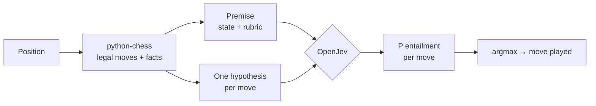

# How JevMate uses OpenJev to play chess

🇮🇹 [Versione italiana](come-funziona.md) · [← README](../README.md)

> **In short:** OpenJev cannot play chess. It does not know the rules, it does not see the board and it does
> not calculate variations. Each turn it reads a description of the position and one sentence per legal move,
> and tells which sentence best fits a rubric of what a "good move" is. JevMate plays that move.

## 1. What OpenJev is

[OpenJev](https://huggingface.co/AlexWortega/openjev) is an **NLI cross-encoder** (*Natural Language
Inference*) built on Qwen3.5. It takes two texts:

- a **premise**, describing how things are;
- a **hypothesis**, a statement to check;

and returns three probabilities: **contradiction**, **entailment**, **neutral**.

It does not generate text and it never saw a chess game during training. It is a judge of consistency between
sentences: the same ability it uses to check answers, filter content or, in the model's README, play Doom and
Minecraft.

## 2. The decision loop

1. **python-chess** generates every legal move and computes objective facts about each one.
2. JevMate writes **one premise** (game state plus rubric) and **one hypothesis per move**.
3. **OpenJev** scores every premise–hypothesis pair in a single forward pass, generating nothing.
4. The move with the **highest entailment probability** wins. The "La mente di OpenJev" panel shows the top 8,
   normalised over the total.

## 3. A real example

Game `1.e4 d5 2.Nf3 f6 3.Bc4 dxc4 4.Nc3 f5 5.d3`, Black to move (screenshot in the README).

**Premise** (one per turn):

> Chess position (FEN …). Black is to move. Material: Black 39, White 36. White just played d3. Black pieces
> under threat: pawn on c4. *A good move wins material, avoids losing pieces, keeps the king safe and improves
> the position.*

**Hypotheses** (29, one per legal move) and the scores of the 0.8B model:

| Move | Hypothesis (shortened) | Entailment | Share |
|---|---|---|---|
| **cxd3** ✅ | captures a pawn (worth 1) · takes space in the centre · **saves the threatened pawn** | 0.49 | 31.8% |
| Qxd3 | captures a pawn · brings the queen out early · **the queen can be captured (it would lose 9)** | 0.32 | 20.3% |
| f4 | the pawn can be captured · leaves undefended: pawn on c4 | 0.13 | 8.6% |
| fxe4 | captures a pawn · can be captured · leaves c4 undefended · attacks the knight | 0.12 | 7.4% |
| Bd7 | develops the bishop · leaves c4 undefended | 0.05 | 3.4% |
| Qd4 | queen out early · the queen can be captured (it would lose 9) | 0.04 | 2.7% |

Time: **1.7 s** to score all 29 moves on a laptop GPU.

The choice (cxd3) is right, and you can see why: it is the only hypothesis that meets **every** part of the
rubric (wins material, saves a piece, loses nothing). You can also see the limit: **Qxd3 gets 20%** even though
it says outright that it loses the queen. The model gave more weight to "captures a pawn" than to "loses 9".

## 4. Who knows what

| Component | What it brings | Example |
|---|---|---|
| **python-chess** | the **rules** and the **facts**: legal moves, captures, checks, pieces en prise | "after it the queen on d3 can be captured" |
| **JevMate** (text) | the **rubric** of a good move and the choice of which facts to tell | "a good move wins material, avoids losing pieces…" |
| **OpenJev** | the **judgement**: how well each description fits the rubric | 0.49 vs 0.32 |

Nearly all the chess knowledge lives in the first two. OpenJev acts as a **semantic referee**: it reads mixed
facts ("saves a pawn", "brings the queen out early", "leaves c4 undefended") and weighs them against a goal
written in plain language, without anyone writing an evaluation function with numeric weights.

## 5. "The most promising move": what it really means

OpenJev **does not maximise the outcome of the game**. It maximises how well a move's description fits the
rubric. Compared with a chess engine:

| | Engine (e.g. Stockfish) | JevMate + OpenJev |
|---|---|---|
| Depth | dozens of plies, including the opponent's replies | **1 move**, no simulated reply |
| Evaluation | numeric function (or network) trained on chess | consistency between sentences, model never trained on chess |
| Goal | win the game | satisfy the rubric written in the premise |
| Explainability | a number (+1.3) | the sentence that convinced the model |

In practice:

- ✅ **avoids blunders** when the facts make them explicit ("loses 9");
- ✅ **finds obvious moves**: mate in 1, a queen left hanging;
- ✅ **is deterministic and explainable**: same position, same move, with a readable reason;
- ❌ **does not see two-move threats**, incoming forks or chains of exchanges: no fact describes them;
- ❌ **barely tells "quiet" moves apart**: when no capture or threat is involved the scores go flat (10–12%)
  and the choice is little better than random.

## 6. Next steps: improving OpenJev's mind

Since OpenJev only judges what it is told, almost every improvement means **telling it about the position
better**. The rule stays the same: OpenJev always picks the move; the evidence gets richer, nobody decides in its
place.

| # | Change | What it does | Expected effect | Cost |
|---|---|---|---|---|
| 0 | **Measure before improving** | automatic games against a random player and against Stockfish at its lowest level; share of moves matching Stockfish on a set of test positions | a number that tells whether each change really helps | low |
| 1 | **Exchange balance** | for every capture, the outcome of the whole sequence on that square ("the exchange wins you 2" / "you lose 3") instead of a plain "can be captured" | stops giving pieces away in exchanges; fixes cases like Qxd3 at 20% | low |
| 2 | **One ply of lookahead as a fact** | for every move, the opponent's best immediate reply written into the hypothesis ("after the move White can capture the queen", "after the move White has mate") | sees one-move traps: forks, pins, mate in 1 against it | medium (about 2–3 s per move) |
| 3 | **Decomposed rubric** | instead of a single "best move" hypothesis, several questions per move (wins material? is it safe? improves the king?) combined with weights, like OpenJev's *typed decisions* | less flat scores among quiet moves, steadier choices | medium |
| 4 | **Rubrics per game phase** | a different premise in the opening (development, castling, centre), middlegame (activity, king attack) and endgame (active king, passed pawns) | more sensible plans, especially in endgames where it now wanders | low |
| 5 | **Rubric wording** | try variants of the rubric sentence and of the facts, measured with step 0 | free gains: the model is sensitive to phrasing | low |
| 6 | **Bigger checkpoint** | 4B v5, which the author recommends for decisions; needs more VRAM (≈8 GB in bf16) or quantisation | finer judgement on the same facts | high |
| 7 | **Chess-trained head** | OpenJev ships `LatentMLPHead`: a small network on top of its hidden state, trainable on positions scored by Stockfish | the biggest jump, but OpenJev is no longer zero-shot: it learns chess | high |

**Suggested order:** 0 → 1 → 2 → 4. They are cheap, stay true to the idea (the model chooses, the code tells) and
cover the weaknesses seen so far. Step 7 changes the nature of the experiment and deserves a separate decision.

## 7. Beyond chess

The pattern is general and works for any decision over a closed set of options:

> **state of the world** (premise) + **rubric** + **one statement per option** (hypothesis)
> → argmax of entailment

Deterministic code computes the rules and the facts, the model gives the judgement. It is the same idea the
OpenJev author uses to play Doom and craft a pickaxe in Minecraft.
